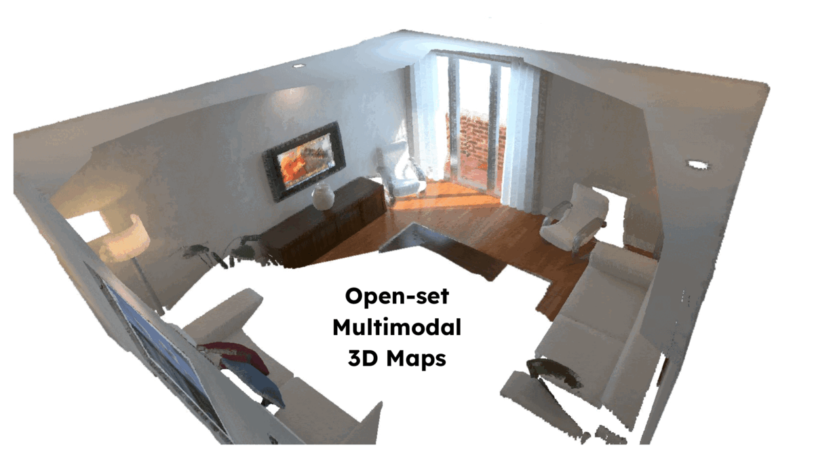

# ConceptFusion: Open-set Multimodal 3D Mapping
> Code release for our [RSS 2023](https://roboticsconference.org/) publication

[Project page](https://concept-fusion.github.io/) | [Video explainer](https://www.youtube.com/watch?v=rkXgws8fiDs) | [arXiv](https://arxiv.org/abs/2302.07241)

[Krishna Murthy Jatavallabhula](https://krrish94.github.io/), [Alihusein Kuwajerwala](https://www.alihkw.com/), [Qiao Gu](https://georgegu1997.github.io/), [Mohd Omama](https://scholar.google.com/citations?user=jFH3ShsAAAAJ&hl=en), [Tao Chen](https://taochenshh.github.io/), [Alaa Maalouf](https://www.csail.mit.edu/person/alaa-maalouf), [Shuang Li](https://people.csail.mit.edu/lishuang/), [Ganesh Iyer](https://epiception.github.io/), [Soroush Saryazdi](https://saryazdi.github.io/), [Nikhil Keetha](https://nik-v9.github.io/), [Ayush Tewari](https://ayushtewari.com/), [Joshua B. Tenenbaum](http://web.mit.edu/cocosci/josh.html), [Celso Miguel de Melo](https://celsodemelo.net/), [Madhava Krishna](https://robotics.iiit.ac.in/), [Liam Paull](http://liampaull.ca/), [Florian Shkurti](http://www.cs.toronto.edu//~florian/), [Antonio Torralba](https://groups.csail.mit.edu/vision/torralbalab/)

<p align="center">
	
</p>


> **Note**: WIP repo with the following key deviations from the ConceptFusion paper
1. Employ the segment anything model (SAM) opposed to Mask2Former to generate mask proposals
2. Remove the mask-to-mask similarity term (uniqueness; Eq. 4) -- needed for Mask2Former, but SAM seems to work okay without
3. (TODO) Add parser and download links for UnCoCo data

## Prerequisites

We recommend setting up a python virtualenv or conda environment to help manage dependencies. Our code has been tested primarily with Python 3.10 (although this should technically work with Python 3.8 with minimal modifications).

Sample instruction for `conda` users.
```
conda create -n conceptfusion python=3.10.8
conda activate conceptfusion
```

**Pytorch**: Install PyTorch using an appropriate Python-CUDA-CuDNN config from the [pytorch webpage](https://pytorch.org/).

**gradslam**: Install the `conceptfusion` branch of [gradlsam](https://gradslam.github.io/) by following these instructions (Note: the `main` branch does not have the feature fusion functionality, and will therefore, not work).
```
git clone https://github.com/gradslam/gradslam.git
cd gradslam
git checkout conceptfusion
pip install -e .
```

**segment-anything**: Install `segment-anything` by following [instructions here](https://github.com/facebookresearch/segment-anything).

**openclip**: Install `openclip` following [instructions here](https://github.com/mlfoundations/open_clip).

**(Optional) OpenAI CLIP**: If interested in using the OpenAI CLIP models, install `clip`.
```
pip install git+https://github.com/openai/CLIP.git
```
Note, however, that our released code isn't set up to use these CLIP models, and may require a few low-effort edits.

## Download and extract datasets

Depending on the dataset you would like to use, download and set it up for gradslam. To extend our (general-enough) dataset class to your own dataset, we recommend looking into the `gradslam` package (again, the `conceptfusion` branch), particularly `gradslam/datasets/` directory. A number of datasets have already been implemented.

### ICL dataset

Download it from [here](https://www.doc.ic.ac.uk/~ahanda/VaFRIC/iclnuim.html). 

For the first two "scenes", i.e. living rooms 'lr kt0' and 'lr kt1', we want to download the files from these two links:

- "TUM RGB-D Compatible PNGs" 
- "Global Poses [R | t]: Global_RT_Trajectory_GT" files. 

### ScanNet and other datasets

**TODO**

## Setup models and download checkpoints

By default, the commandline arguments are setup to run conceptfusion feature extraction (i.e., CLIP features from an `openclip` model). If you would like to use DINO or LSeg features instead, follow these setup instructions. Else, this section may safely be ignored.

### DINO and/or LSeg models

From the dino repo [here](https://github.com/facebookresearch/dino) get the "ViT-B/8 backbone only" checkpoint 

From the Lseg-minimal repo [here](https://github.com/krrish94/lseg-minimal#download-pretrained-weights) , get the checkpoint from the onedrive link.

Put these files in the checkpoints folder:

`/your/path/to/concept-fusion/examples/checkpoints/`

Full structure:
```
├── checkpoints
│   ├── dino_vitbase8_pretrain.pth
│   └── lseg_minimal_e200.ckpt
```

Also, clone and setup the `lseg-minimal` and `dino-minimal` repos -- used in running the pretrained networks for feature extraction. (These can be installed anywhere in your env, and do not have to be within the `concept-fusion` directory)


```
cd /path/to/where/you/keep/repos
git clone https://github.com/krrish94/lseg-minimal
cd lseg-minimal
python setup.py build develop
```
> Download the pretrained weights for the model(s) used in the `lseg-minimal` repo (instructions/links in readme)

```
cd /path/to/where/you/keep/repos
git clone https://github.com/krrish94/dino-minimal
cd dino-minimal
python setup.py build develop
```
> The pretrained weights for DINO will automatically be downloaded by this library when you run it for the first time


## Extract ConceptFusion features

To extract pixel-aligned CLIP features from a `GradSLAMDataset`, run
```
cd examples
python extract_conceptfusion_features.py
```

This script can parse any dataset compatible with the `GradSLAMDataset` format. It extracts mask proposals from SAM, computes CLIP features per-mask (and for the full image), and applies the pixel-aligned feature extraction scheme proposed in the paper (with the caveats at the top of this README).

The extracted features are saved in the `saved-feat` directory by default (this can be overridden by passing a `--feat_dir` argument).


## (Optional) Extract DINO and/or LSeg features

To extract features from other models like DINO or LSeg, run `run_feature_fusion_and_save_map.py` with `--mode extract` (and other flags as appropriate; importantly `--checkpoint_path`).

## Fuse extracted features to a 3D map

After extracting features, fuse them to 3D by running
```
python run_feature_fusion_and_save_map.py
```

This script fuses the extracted features into a 3D pointcloud map, and saved this by default to the `saved-map` directory.

## Try out the examples (and interactive demos)


### Interactive demo - click a point on the scene; visualize self similar points

```
python demo_click_query.py --load_path saved-map
```

This script will load the map saved in the `saved-map` directory. An Open3D window will pop up, where you can click on a point (`SHIFT + LEFT_MOUSE_BUTTON`). (while you can technically click multiple points, we discard all but the first clicked point). The script will then plot a similarity heatmap indicating all other scene points and their similarities, visualized in a `jet` colormap (red => higher similarity; blue => lower similarity).

### Interactive demo - text query

```
python demo_text_query.py --load_path saved-map
```

This script will load the map saved in the `saved-map` directory. You may type in a text query on the console (or press `q` to quit), and a similarity map will be displayed (again, using a `jet` colormap).

### TODO

(TODO - add K-means clustering demo)

If interested in running the K-Means clustering demo, you will need to install `fast-pytorch-kmeans`
```
pip install fast-pytorch-kmeans
```


## Outdated instructions

The instructions that follow are outdated, but are retained here, to help understand typical commandline arguments for other datasets such as ScanNet.
### Examples on use run_feature_fusion_and_save_map.py

The fourth step should also work on OpenSeg by setting `--model_type ovseg`.

```
# 0. Change these settings to your own path
SCENE_ID=scene0568_00
SCANNET_ROOT=/home/qiao/data/scannet/scans
DIR_FEAT=/home/qiao/data/scannet/results/${SCENE_ID}-lseg-0-500
DIR_SAVE_MAP=/home/qiao/data/scannet/results/saved-maps-${SCENE_ID}-lseg-0-500
DIR_SAVE_GT=/home/qiao/data/scannet/results/saved-maps-gt-${SCENE_ID}-lseg-0-500
DIR_SAVE_METRICS=/home/qiao/data/scannet/results/metrics-${SCENE_ID}-lseg-0-500

# 1. Extract feature map for each frame and save them to disk
python run_feature_fusion_and_save_map.py --mode extract --model_type lseg --dataconfig_path dataconfigs/scannet/${SCENE_ID}.yaml --dataset_path $SCANNET_ROOT --sequence ${SCENE_ID} --image_height 480 --image_width 640  --frame_start 0 --frame_end 500 --stride 25 --desired_feature_height 240 --desired_feature_width 320 --feat_dir $DIR_FEAT --dir_to_save_map $DIR_SAVE_MAP --checkpoint_path checkpoints/lseg_minimal_e200.ckpt

# 2. Load the saved feature map, fuse them and save the result to disk
python run_feature_fusion_and_save_map.py --mode fusion --model_type lseg --dataconfig_path dataconfigs/scannet/${SCENE_ID}.yaml --dataset_path $SCANNET_ROOT --sequence ${SCENE_ID} --image_height 240 --image_width 320  --frame_start 0 --frame_end 500 --stride 25 --desired_feature_height 240 --desired_feature_width 320 --feat_dir $DIR_FEAT --dir_to_save_map $DIR_SAVE_MAP --checkpoint_path checkpoints/lseg_minimal_e200.ckpt

# 3. Fuse the GT semantic labels, get per-point GT classification and save them to disk
python run_scannet_feature_fusion_and_save_map.py --mode fusion-gt --dataconfig_path dataconfigs/scannet/${SCENE_ID}.yaml --dataset_path $SCANNET_ROOT --sequence ${SCENE_ID} --image_height 240 --image_width 320  --frame_start 0 --frame_end 500 --stride 25 --desired_feature_height 240 --desired_feature_width 320 --feat_dir $DIR_FEAT --dir_to_save_gt $DIR_SAVE_GT --checkpoint_path checkpoints/lseg_minimal_e200.ckpt

# 4. Evaluate the result and compute metrics (4 variants below). Remember to change DIR_SAVE_METRICS to your own path. 

## 4-1. Use the text embeddings as the query features
python run_scannet_feature_fusion_and_save_map.py --mode metrics --model_type lseg --dataconfig_path dataconfigs/scannet/${SCENE_ID}.yaml --dataset_path $SCANNET_ROOT --sequence ${SCENE_ID} --image_height 240 --image_width 320  --frame_start 0 --frame_end 500 --stride 25 --desired_feature_height 240 --desired_feature_width 320 --feat_dir $DIR_FEAT --dir_to_save_map $DIR_SAVE_MAP --dir_to_save_gt $DIR_SAVE_GT --dir_to_save_metrics $DIR_SAVE_METRICS --checkpoint_path checkpoints/lseg_minimal_e200.ckpt

## 4-2. Use the feature means (Oracle) as the query features
DIR_SAVE_METRICS=/home/qiao/data/scannet/results/metrics-oracle-${SCENE_ID}-lseg-0-500
python run_scannet_feature_fusion_and_save_map.py --mode metrics --model_type lseg --dataconfig_path dataconfigs/scannet/${SCENE_ID}.yaml --dataset_path $SCANNET_ROOT --sequence ${SCENE_ID} --image_height 240 --image_width 320  --frame_start 0 --frame_end 500 --stride 25 --desired_feature_height 240 --desired_feature_width 320 --feat_dir $DIR_FEAT --dir_to_save_map $DIR_SAVE_MAP --dir_to_save_gt $DIR_SAVE_GT --dir_to_save_metrics $DIR_SAVE_METRICS --checkpoint_path checkpoints/lseg_minimal_e200.ckpt --query_feat oracle

## 4-3. Use the feature means of random 1 points as the query features (multiple runs recommended)
DIR_SAVE_METRICS=/home/qiao/data/scannet/results/metrics-rand1p-${SCENE_ID}-lseg-0-500
python run_scannet_feature_fusion_and_save_map.py --mode metrics --model_type lseg --dataconfig_path dataconfigs/scannet/${SCENE_ID}.yaml --dataset_path $SCANNET_ROOT --sequence ${SCENE_ID} --image_height 240 --image_width 320  --frame_start 0 --frame_end 500 --stride 25 --desired_feature_height 240 --desired_feature_width 320 --feat_dir $DIR_FEAT --dir_to_save_map $DIR_SAVE_MAP --dir_to_save_gt $DIR_SAVE_GT --dir_to_save_metrics $DIR_SAVE_METRICS --checkpoint_path checkpoints/lseg_minimal_e200.ckpt --query_feat random --n_point_query 1

## 4-4. Use the feature means of random 3 points as the query features (multiple runs recommended)
DIR_SAVE_METRICS=/home/qiao/data/scannet/results/metrics-rand3p-${SCENE_ID}-lseg-0-500
python run_scannet_feature_fusion_and_save_map.py --mode metrics --model_type lseg --dataconfig_path dataconfigs/scannet/${SCENE_ID}.yaml --dataset_path $SCANNET_ROOT --sequence ${SCENE_ID} --image_height 240 --image_width 320  --frame_start 0 --frame_end 500 --stride 25 --desired_feature_height 240 --desired_feature_width 320 --feat_dir $DIR_FEAT --dir_to_save_map $DIR_SAVE_MAP --dir_to_save_gt $DIR_SAVE_GT --dir_to_save_metrics $DIR_SAVE_METRICS --checkpoint_path checkpoints/lseg_minimal_e200.ckpt --query_feat random --n_point_query 3
```

For 4-3 and 4-4, it would be better to run the commands multiple times with different seeds and average the results. For example:

```
DIR_SAVE_METRICS=/home/qiao/data/scannet/results/metrics-rand3p-${SCENE_ID}-lseg-0-500

for SEED in {1..10}
do
python run_scannet_feature_fusion_and_save_map.py --mode metrics --model_type lseg --dataconfig_path dataconfigs/scannet/${SCENE_ID}.yaml --dataset_path $SCANNET_ROOT --sequence ${SCENE_ID} --image_height 240 --image_width 320  --frame_start 0 --frame_end 500 --stride 25 --desired_feature_height 240 --desired_feature_width 320 --feat_dir $DIR_FEAT --dir_to_save_map $DIR_SAVE_MAP --dir_to_save_gt $DIR_SAVE_GT --dir_to_save_metrics $DIR_SAVE_METRICS --checkpoint_path checkpoints/lseg_minimal_e200.ckpt --query_feat random --n_point_query 3 --seed $SEED
done
```


